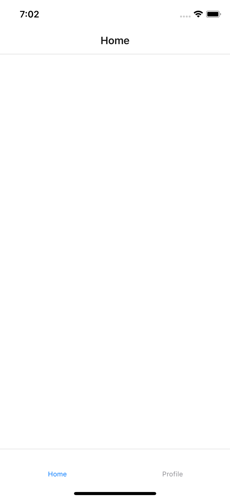

<h1>Introduction</h1>
INTUZ represents integration of navigation drawer, bottom tabs, stack navigator and switch navigator using react-navigation. It also contains how to handle session data using AsyncStorage in react-native.
Let’s ready to implement it.

 
<h1>Features</h1>

- Simple Login and Signup UI
- Navigation drawer
 

- Bottom tabs
 

- Stack Navigation
- Store session data using AsyncStorage

<h1>Bugs and Feedback</h1>

For bugs, questions and discussions please use the Github Issues.

 
<h1>License</h1>

Copyright (c) 2019 Intuz.
  
Permission is hereby granted, free of charge, to any person obtaining a copy of this software and associated documentation files (the "Software"), to deal in the Software without restriction, including without limitation the rights to use, copy, modify, merge, publish, distribute, sublicense, and/or sell copies of the Software, and to permit persons to whom the Software is furnished to do so, subject to the following conditions:
  
THE SOFTWARE IS PROVIDED "AS IS", WITHOUT WARRANTY OF ANY KIND, EXPRESS OR IMPLIED, INCLUDING BUT NOT LIMITED TO THE WARRANTIES OF MERCHANTABILITY, FITNESS FOR A PARTICULAR PURPOSE AND NONINFRINGEMENT. IN NO EVENT SHALL THE AUTHORS OR COPYRIGHT HOLDERS BE LIABLE FOR ANY CLAIM, DAMAGES OR OTHER LIABILITY, WHETHER IN AN ACTION OF CONTRACT, TORT OR OTHERWISE, ARISING FROM, OUT OF OR IN CONNECTION WITH THE SOFTWARE OR THE USE OR OTHER DEALINGS IN THE SOFTWARE.

<h1></h1>

